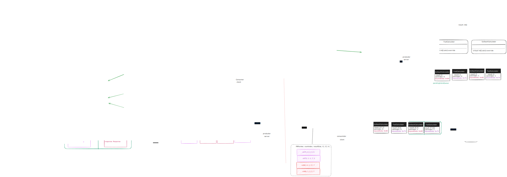

# Concurrent Web Server (Technical Documentation)

## Overview
This project implements a concurrent web server in C++ designed to handle multiple client requests simultaneously. The server leverages the **Pthreads** library to create and manage threads, allowing efficient handling of multiple requests by processing them in parallel.

The server hosts two web applications:
1. **Prime Factorization**: Decomposes a number into its prime factors.
2. **Goldbach Sums**: Finds prime pairs that sum up to a given even number (related to the Goldbach conjecture).

## Problem Statement
Once we understand the concept of a web server, we can start to think about the problem. This project are base in <a href="https://jeisson.ecci.ucr.ac.cr/concurrente/2021b/ejemplos/#prod_cons_pattern"> Jeisson Hidalgo's code</a> that implements the producer-consumer pattern. The producer-consumer pattern is a synchronization pattern that allows us to create a buffer between two threads. The producer thread writes data to the buffer and the consumer thread reads data from the buffer. There's an image taken from <a href="https://jeisson.ecci.ucr.ac.cr/concurrente/2021b/ejemplos/#prod_cons_pattern"> Jeisson Hidalgo's ecample</a> that shows the producer-consumer pattern.


I our case we need modify the code to convert it from serial implementation to a concurrent implementation. The server should be able to handle multiple requests concurrently.

## Architecture
The server is built with a modular architecture, where different components handle specific tasks:
- **Connection Pool**: Manages threads that handle incoming client requests.
- **Request Queue**: Stores incoming connection requests, which are processed by the thread pool.
- **HttpConnectionHandler**: Processes each client’s HTTP request and generates the appropriate response.

The following diagram illustrates the server's architecture:



## Server Workflow
1. **Listening for Connections**: The server listens on a specified port for incoming HTTP requests.
2. **Queueing Requests**: Accepted connections are enqueued in a request queue.
3. **Processing Requests**: The connection pool dispatches threads to handle each request from the queue.
4. **Sending Responses**: Each request handler processes and sends an HTTP response back to the client, delivering either the prime factorization result or Goldbach sum pairs.

## Applications

### Prime Factorization
- **Endpoint**: `/fact`
- **Function**: Decomposes a given number into its prime factors.
- **Request Format**: 
GET /fact?number=<'number'>


### Goldbach Sums
- **Endpoint**: `/goldbach`
- **Function**: Finds pairs of prime numbers that sum up to a specified even number.
- **Request Format**: 
GET /goldbach?number=<'number'>


## Concurrency Details
The server uses a **producer-consumer model**:
- **Producer**: Accepts incoming connections and enqueues them.
- **Consumer**: A pool of threads that dequeues and processes each request. Each thread runs an instance of `HttpConnectionHandler`, which processes the request and sends the response.

This concurrent model allows the server to handle multiple client connections efficiently, balancing load across threads.

## Installation and Setup

### Prerequisites
- C++ compiler with support for Pthreads (e.g., GCC on Unix-based systems)
- `make` utility

### Steps
1. Clone the repository:
 ```bash
 git clone <repository_url>
 cd <repository_folder>
```
2. Compile the server:

```bash
make -j
```

3. Run the server:

```bash
make run
```

