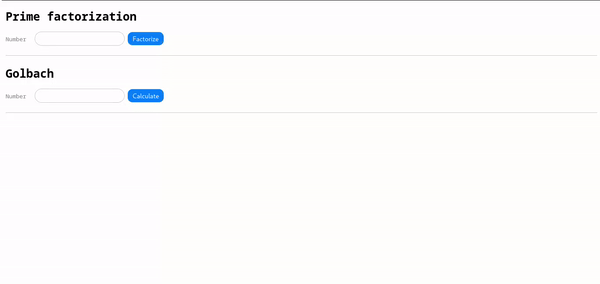
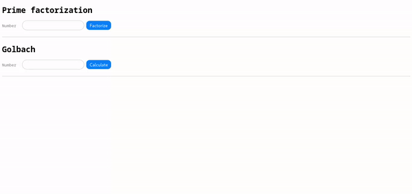

# Concurrent Web Server

## Introduction
This project is a simple, fast web server designed to handle multiple user requests at the same time. It allows users to interact with web apps hosted on the server efficiently, even when many people are accessing it simultaneously.

## What Can This Server Do?
- **Serve Web Pages**: The server can deliver web pages to your browser, similar to the way popular websites operate.
- **Efficient Handling**: The server manages multiple users at once, so your browsing experience remains smooth even during heavy use.
- **Quick Responses**: It’s optimized to respond to requests as quickly as possible, making it suitable for lightweight websites and applications.

- **Developers**: Useful for testing how web pages handle multiple simultaneous connections.

## How It Works (In Simple Terms)
1. **Listening for Requests**: The server is constantly "listening" for someone to visit the website.
2. **Handling Multiple Users**: When multiple people visit the website at once, the server can handle each visitor without making anyone wait.
3. **Serving Web Pages**: The server sends the requested pages back to each visitor, allowing them to see the content in their browser.


## Visual Overview
Here’s a simple diagram that explains how users interact with the server:


## Frequently Asked Questions (FAQ)

### 1. How do I access the server from my browser?
Open your browser and enter the server's address and port (e.g., `http://localhost:8080`). This lets you view the hosted content.


## Web Applications: Prime Factorization and Goldbach Sums

This server hosts two interactive web applications, accessible through your browser:

### 1. Prime Factorization App
The Prime Factorization app allows you to enter a number and get its prime factors.

#### How to Use:


Also you can pass the number as a query parameter in the URL, for example:
```
http://localhost:8080/factor?number=123456
```

If you need process multiple numbers, you can pass a list of numbers separated by commas, for example:
```
http://localhost:8080/factor?number=123456,7890,123
```

### 2. Goldbach Sums App
The Goldbach Sums App allows you to enter a number and get its prime factors.

#### How to Use:


Also you can pass the number as a query parameter in the URL, for example:
```
http://localhost:8080/factor?number=123456
```

If you need process multiple numbers, you can pass a list of numbers separated by commas, for example:
```
http://localhost:8080/factor?number=123456,7890,123
```


## Credits
Developed by:
- Isaías Alfaro Ugalde
- Aaron Santana Valdelomar
