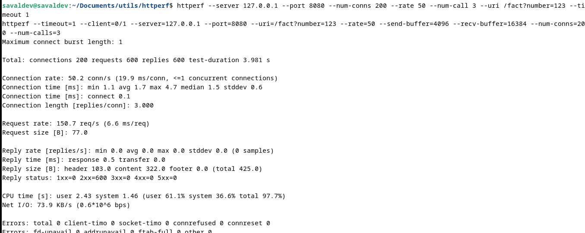

# Concurrent Web Server

## Introduction
This project is a simple web server that can handle multiple requests concurrently. For that purpose, we used <a href="https://es.wikipedia.org/wiki/Pthreads"> Pthreads ,</a> library that allows us to create threads in C++. 

## What is a Web Server?
Before start the explanation of the project, we need to understand what is a web server. A web server is a software that uses HTTP protocol to serve the files that form the web pages to the clients. The clients are the web browsers that request the files to the server. The server receives the request, processes it and sends the response back to the client.

## How does it work?
The server is a simple program that listens to a port and waits for incoming connections. When a client connects to the server handle the request. The request handler reads the request, processes it and sends the response back to the client. But, what happens if another client connects to the server while the first client is being served? Well the server should be a multi-tasking expert and handle the requests concurrently, and this is our goal.

## Problem Statement
Once we understand the concept of a web server, we can start to think about the problem. This project are base in <a href="https://jeisson.ecci.ucr.ac.cr/concurrente/2021b/ejemplos/#prod_cons_pattern"> Jeisson Hidalgo's code</a> that implements the producer-consumer pattern. The producer-consumer pattern is a synchronization pattern that allows us to create a buffer between two threads. The producer thread writes data to the buffer and the consumer thread reads data from the buffer. There's an image taken from <a href="https://jeisson.ecci.ucr.ac.cr/concurrente/2021b/ejemplos/#prod_cons_pattern"> Jeisson Hidalgo's ecample</a> that shows the producer-consumer pattern.

I our case we need modify the code to convert it from serial implementation to a concurrent implementation. The server should be able to handle multiple requests concurrently.

## Solution
To solve we need to create a class that are exclusively in charge of handling the requests. This class is called HttpConnectionHandler. The HttpConnectionHandler class has a method called handleClientConnection that receives the client socket as a parameter. The handleClientConnection method reads the request, processes it and sends the response back to the client. The HttpConnectionHandler class is a thread class extended from Consumer class, so we can create multiple instances of this class and run them concurrently.

### What do the server now?
The server now it's a controller and do the following:

#### Step 1: Create connection handlers
The server creates a pool of connection handlers. The pool size is defined by the user as parameter. The server creates the connection handlers and stores them in a vector.

#### Step 2: Create connection sockets queue
The server creates a queue of connection sockets.

#### Step 3: Accept incoming connections
The server listens to a port and accepts incoming connections. When a connection is accepted, the server enqueues the connection socket in the queue.

That's all the server does. The connection handlers are the ones that handle the requests.

## Cocurrency tests

We use httpref to test the concurrency of the server and the results are shown below:

## Credits
This project was developed by:
- Isaías Alfaro Ugalde
- Aaron Santana Valdelomar
- Caleb Ruiz