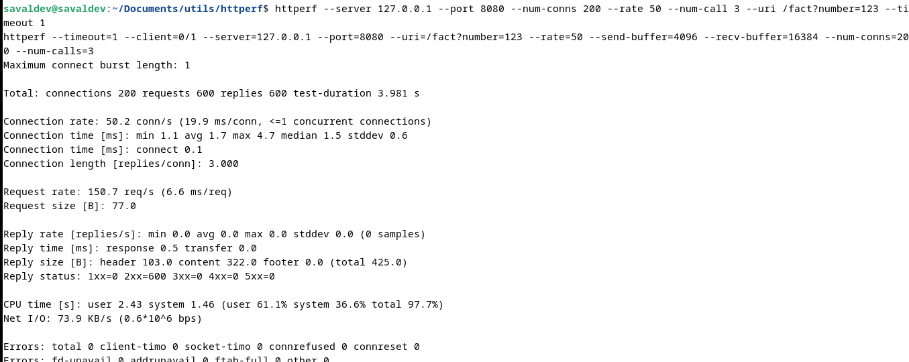

## Build

In order to build the solution, the following must be done:

* Open a terminal and locate it in the folder called porject1-1 of the project.
* In this terminal you have to type the following command "make".
* This command will completely construct the solution of the task.

## Execution

To run the program, you have to do the following:

* Open a terminal and locate it in the folder called porject1-1 of the project.
* In this terminal you have to type the following command "make run".
* This command will compile and execute the task solution.
* In this step you can just type make run to compile by default
  * You can also add the port and threads to execute manually(For more help type bin/project1-1 help).

### Example input:
* make run
* make run 8080 6

### Example of output:
* Info    webserver       Listening on 0.0.0.0 port 8080

## Finish the web

To finish the connection to the web, you have to go to the terminal and put ctrl + c.
# User manual

This part is to be able to explain the use of the website.
* When you or someone connected to the web you are going to see to differents parts.
* The first one is for factorial, you have to enter a number in the blank, you can put:
  * One number, several numbers followed by commas and negatives.
  * Cannot place blank spaces.
* The second one is for goldbach, is very similar than factorial, but you are gona have the goldbach conjeture.
***

# Design

Concurrent web server, which follows the producer consumer pattern and lets a user factor or golbach some number

  

For more information about the design see the design folder.

  

***
# Concurrency Test

You can test the concurrency of the project using [httperf]([httperf/httperf: El generador de carga HTTP httperf (github.com)](https://github.com/httperf/httperf))

The comands that you need for the test are:
* $ ip addr | grep -E '\b\d+(\.\d+){3}\b'
* $ bin/webserv 8080 30 70
* $ httperf --server 10.137.1.117 --port 8080 --num-conns 200 --rate 50 --num-call 3 --uri /fact?number=123 --timeout 1

Explain arguments
* --server 10.137.1.117: It is the IP address of the computer
* --port 8080: It is the port od the computer
* --num-conns 200: the connections to be made
* --rate 50: The connectios per second
* --num-call 3: How many calls per connection
* --uri /fact?number=123: The URL
* --timeout 1: The time that the program wait per the other connections

On the github page you will see how to install and read the data that this tool gives when using these commands

Expected response (Data may vary)

***
